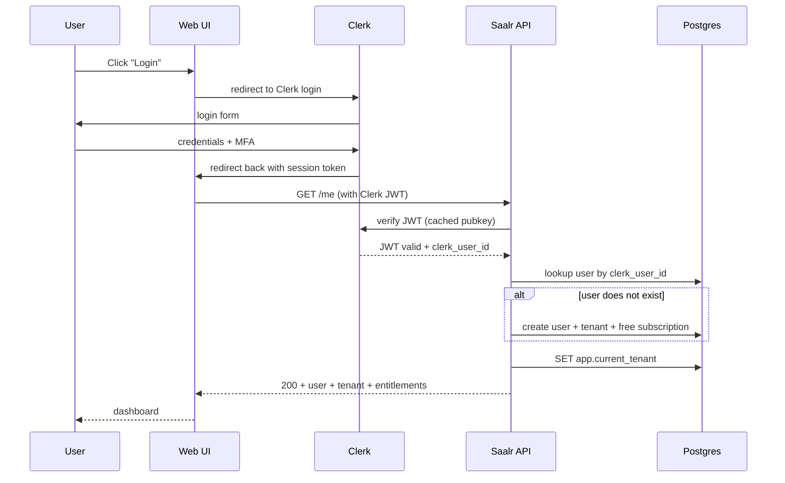

# Saalr — Low-Level Design (LLD)

**Document version:** 2.1 (May 2026)
**Status:** Spec — seed-deck aligned (validation-first)
**Supersedes:** v1.0 (personal-platform LLD)
**Companion documents:** Architecture, HLD

---

## 1. Document purpose

The HLD defines services and contracts. This LLD defines exactly what to implement: database DDL, API request/response schemas, module structures, state machines, algorithm specifications, event schemas, error codes, and configuration shapes.

When you sit down to code, this document tells you the column names, the JSON on the wire, the order things happen in, and how errors are reported.

---

## 2. Conventions

### 2.1 Identifiers
- All entity IDs are **UUID v7** (time-ordered UUIDs). Generated server-side. Never expose internal integers.
- All identifiers are URL-safe base64 (no hyphens) when exposed in URLs: `str_01HXY...`.
- ID prefixes by entity: `usr_`, `ten_`, `sub_`, `str_`, `bt_`, `ord_`, `pos_`, `mdl_`, `rsr_`.

### 2.2 Time
- All timestamps are `TIMESTAMPTZ` in UTC at rest. Format on wire: RFC 3339 (`2026-05-25T10:30:00Z`).
- Never store local time. Display layer does the conversion using user's timezone preference.

### 2.3 Money
- All monetary amounts are `NUMERIC(18,8)`. No floats, ever.
- Currency is always explicit alongside amount (`amount_usd`, `amount_inr`).
- For prices, options premiums: `NUMERIC(18,8)`. For percentages: `NUMERIC(10,6)` (e.g., `0.150000` = 15%).

### 2.4 API conventions
- REST. JSON request/response bodies. snake_case keys.
- Versioning: URL path. Current is `/v1/`. Future breaking changes go to `/v2/`.
- Pagination: cursor-based. `?cursor=...&limit=...`. Response includes `next_cursor` if more results.
- Errors: structured JSON (see §10).
- Timestamps in response are RFC 3339 strings.

---

## 3. Database schema

PostgreSQL 16 with TimescaleDB extension. The schema below is illustrative DDL — production migrations will be incremental.

### 3.1 Multi-tenancy primitives

```sql
CREATE TABLE tenants (
  tenant_id           UUID PRIMARY KEY,
  display_name        TEXT NOT NULL,
  country_code        CHAR(2) NOT NULL,  -- 'US', 'IN', etc.
  created_at          TIMESTAMPTZ NOT NULL DEFAULT NOW(),
  status              TEXT NOT NULL DEFAULT 'active'
    CHECK (status IN ('active', 'suspended', 'closed'))
);

CREATE TABLE users (
  user_id             UUID PRIMARY KEY,
  email               CITEXT UNIQUE NOT NULL,
  email_verified_at   TIMESTAMPTZ,
  created_at          TIMESTAMPTZ NOT NULL DEFAULT NOW(),
  clerk_user_id       TEXT UNIQUE,  -- ID from auth provider
  preferred_tz        TEXT NOT NULL DEFAULT 'UTC',
  preferred_locale    TEXT NOT NULL DEFAULT 'en-US'
);

CREATE TABLE memberships (
  user_id             UUID NOT NULL REFERENCES users(user_id),
  tenant_id           UUID NOT NULL REFERENCES tenants(tenant_id),
  role                TEXT NOT NULL CHECK (role IN ('owner', 'admin', 'member')),
  created_at          TIMESTAMPTZ NOT NULL DEFAULT NOW(),
  PRIMARY KEY (user_id, tenant_id)
);

CREATE INDEX idx_memberships_tenant ON memberships(tenant_id);

CREATE TABLE api_keys (
  key_id              UUID PRIMARY KEY,
  tenant_id           UUID NOT NULL REFERENCES tenants(tenant_id),
  user_id             UUID NOT NULL REFERENCES users(user_id),
  key_hash            TEXT NOT NULL,           -- bcrypt of actual key
  key_prefix          TEXT NOT NULL,           -- first 8 chars for display
  label               TEXT,
  scopes              TEXT[] NOT NULL,         -- e.g., {'read:portfolio', 'write:orders'}
  created_at          TIMESTAMPTZ NOT NULL DEFAULT NOW(),
  last_used_at        TIMESTAMPTZ,
  revoked_at          TIMESTAMPTZ
);

CREATE INDEX idx_api_keys_tenant ON api_keys(tenant_id) WHERE revoked_at IS NULL;
```

### 3.2 Subscription & billing

```sql
CREATE TABLE subscriptions (
  subscription_id     UUID PRIMARY KEY,
  tenant_id           UUID NOT NULL REFERENCES tenants(tenant_id),
  tier                TEXT NOT NULL CHECK (tier IN ('free', 'pro', 'premium')),
  status              TEXT NOT NULL CHECK (status IN ('active', 'past_due', 'cancelled', 'trialing')),
  provider            TEXT NOT NULL CHECK (provider IN ('stripe', 'razorpay', 'manual')),
  provider_subscription_id  TEXT,
  current_period_start TIMESTAMPTZ NOT NULL,
  current_period_end   TIMESTAMPTZ NOT NULL,
  cancel_at_period_end BOOLEAN NOT NULL DEFAULT FALSE,
  created_at          TIMESTAMPTZ NOT NULL DEFAULT NOW(),
  updated_at          TIMESTAMPTZ NOT NULL DEFAULT NOW()
);

CREATE UNIQUE INDEX idx_subscriptions_tenant_active
  ON subscriptions(tenant_id) WHERE status = 'active';

CREATE TABLE billing_events (
  event_id            UUID PRIMARY KEY,
  tenant_id           UUID NOT NULL REFERENCES tenants(tenant_id),
  subscription_id     UUID REFERENCES subscriptions(subscription_id),
  event_type          TEXT NOT NULL,         -- 'invoice.paid', 'charge.failed', etc.
  amount              NUMERIC(18,8),
  currency            CHAR(3),
  provider_event_id   TEXT UNIQUE,            -- idempotency key from provider
  raw_event           JSONB NOT NULL,         -- full provider payload
  received_at         TIMESTAMPTZ NOT NULL DEFAULT NOW()
);
```

### 3.3 Strategies & backtests

```sql
CREATE TABLE strategies (
  strategy_id         UUID PRIMARY KEY,
  tenant_id           UUID NOT NULL REFERENCES tenants(tenant_id),
  user_id             UUID NOT NULL REFERENCES users(user_id),
  name                TEXT NOT NULL,
  description         TEXT,
  state               TEXT NOT NULL CHECK (state IN
                        ('draft', 'backtested', 'paper', 'live', 'paused', 'archived')),
  config_json         JSONB NOT NULL,       -- legs, entry/exit rules, indicators
  market              CHAR(2) NOT NULL,      -- 'US' or 'IN'
  broker_account_id   UUID REFERENCES broker_accounts(broker_account_id),
  created_at          TIMESTAMPTZ NOT NULL DEFAULT NOW(),
  updated_at          TIMESTAMPTZ NOT NULL DEFAULT NOW(),
  promoted_to_live_at TIMESTAMPTZ,
  paused_at           TIMESTAMPTZ,
  paused_reason       TEXT
);

CREATE INDEX idx_strategies_tenant ON strategies(tenant_id);
CREATE INDEX idx_strategies_state ON strategies(state) WHERE state IN ('paper', 'live');

CREATE TABLE backtests (
  backtest_id         UUID PRIMARY KEY,
  tenant_id           UUID NOT NULL REFERENCES tenants(tenant_id),
  strategy_id         UUID NOT NULL REFERENCES strategies(strategy_id),
  start_date          DATE NOT NULL,
  end_date            DATE NOT NULL,
  status              TEXT NOT NULL CHECK (status IN
                        ('queued', 'running', 'succeeded', 'failed')),
  metrics_json        JSONB,                -- {sharpe, sortino, max_dd, win_rate, ...}
  trade_log_uri       TEXT,                  -- S3 URI to per-trade CSV (s3://saalr-backtests/...)
  config_snapshot     JSONB NOT NULL,        -- copy of strategy config at run time
  error_message       TEXT,
  started_at          TIMESTAMPTZ,
  completed_at        TIMESTAMPTZ,
  created_at          TIMESTAMPTZ NOT NULL DEFAULT NOW()
);
```

### 3.4 Orders, positions, executions

```sql
CREATE TABLE broker_accounts (
  broker_account_id   UUID PRIMARY KEY,
  tenant_id           UUID NOT NULL REFERENCES tenants(tenant_id),
  user_id             UUID NOT NULL REFERENCES users(user_id),
  broker              TEXT NOT NULL CHECK (broker IN
                        ('alpaca', 'ibkr', 'zerodha', 'angelone')),
  account_label       TEXT NOT NULL,
  credential_ref      TEXT NOT NULL,         -- AWS Secrets Manager ARN; no keys in DB
  is_paper            BOOLEAN NOT NULL,
  status              TEXT NOT NULL CHECK (status IN ('active', 'disconnected', 'revoked')),
  last_reconciled_at  TIMESTAMPTZ,
  created_at          TIMESTAMPTZ NOT NULL DEFAULT NOW()
);

CREATE TABLE orders (
  order_id            UUID PRIMARY KEY,
  tenant_id           UUID NOT NULL REFERENCES tenants(tenant_id),
  strategy_id         UUID REFERENCES strategies(strategy_id),
  broker_account_id   UUID NOT NULL REFERENCES broker_accounts(broker_account_id),
  symbol              TEXT NOT NULL,
  option_type         TEXT CHECK (option_type IN ('CE', 'PE', 'CALL', 'PUT', NULL)),
  strike              NUMERIC(18,8),
  expiry              DATE,
  side                TEXT NOT NULL CHECK (side IN ('buy', 'sell')),
  qty                 INTEGER NOT NULL CHECK (qty > 0),
  order_type          TEXT NOT NULL CHECK (order_type IN ('market', 'limit', 'stop', 'stop_limit')),
  limit_price         NUMERIC(18,8),
  stop_price          NUMERIC(18,8),
  time_in_force       TEXT NOT NULL CHECK (time_in_force IN ('day', 'gtc', 'ioc', 'fok')),
  status              TEXT NOT NULL CHECK (status IN
                        ('pending', 'submitted', 'partial', 'filled', 'cancelled', 'rejected')),
  broker_order_id     TEXT,
  idempotency_key     TEXT,
  reject_reason_code  TEXT,
  created_at          TIMESTAMPTZ NOT NULL DEFAULT NOW(),
  submitted_at        TIMESTAMPTZ,
  filled_at           TIMESTAMPTZ
);

CREATE UNIQUE INDEX idx_orders_idempotency
  ON orders(tenant_id, idempotency_key) WHERE idempotency_key IS NOT NULL;
CREATE INDEX idx_orders_tenant_status ON orders(tenant_id, status);

CREATE TABLE executions (
  execution_id        UUID PRIMARY KEY,
  tenant_id           UUID NOT NULL REFERENCES tenants(tenant_id),
  order_id            UUID NOT NULL REFERENCES orders(order_id),
  qty                 INTEGER NOT NULL,
  price               NUMERIC(18,8) NOT NULL,
  commission          NUMERIC(18,8) DEFAULT 0,
  broker_execution_id TEXT NOT NULL,
  executed_at         TIMESTAMPTZ NOT NULL
);

CREATE UNIQUE INDEX idx_executions_broker_id
  ON executions(broker_account_id, broker_execution_id);

CREATE TABLE positions (
  position_id         UUID PRIMARY KEY,
  tenant_id           UUID NOT NULL REFERENCES tenants(tenant_id),
  broker_account_id   UUID NOT NULL REFERENCES broker_accounts(broker_account_id),
  symbol              TEXT NOT NULL,
  option_type         TEXT,
  strike              NUMERIC(18,8),
  expiry              DATE,
  qty                 INTEGER NOT NULL,
  avg_entry_price     NUMERIC(18,8) NOT NULL,
  opened_at           TIMESTAMPTZ NOT NULL,
  last_updated_at     TIMESTAMPTZ NOT NULL DEFAULT NOW()
);

CREATE INDEX idx_positions_tenant ON positions(tenant_id);
```

### 3.5 Audit log

```sql
CREATE TABLE audit_log (
  audit_id            UUID PRIMARY KEY,
  tenant_id           UUID NOT NULL,
  user_id             UUID,
  action              TEXT NOT NULL,         -- 'order.submitted', 'strategy.promoted', etc.
  target_type         TEXT,                   -- 'order', 'strategy', 'subscription'
  target_id           UUID,
  before_state        JSONB,
  after_state         JSONB,
  request_id          TEXT NOT NULL,
  trace_id            TEXT,
  ip_address          INET,
  user_agent          TEXT,
  occurred_at         TIMESTAMPTZ NOT NULL DEFAULT NOW()
);

CREATE INDEX idx_audit_tenant_time ON audit_log(tenant_id, occurred_at DESC);
CREATE INDEX idx_audit_target ON audit_log(target_type, target_id) WHERE target_id IS NOT NULL;

-- Mirror to S3 with Object Lock in Compliance mode (immutable archive) — daily export job via ECS Scheduled Task
```

### 3.6 Market data (TimescaleDB hypertables)

```sql
CREATE TABLE bars (
  ts                  TIMESTAMPTZ NOT NULL,
  symbol              TEXT NOT NULL,
  market              CHAR(2) NOT NULL,        -- 'US' or 'IN'
  interval            TEXT NOT NULL,           -- '1m', '5m', '1h', '1d'
  open                NUMERIC(18,8) NOT NULL,
  high                NUMERIC(18,8) NOT NULL,
  low                 NUMERIC(18,8) NOT NULL,
  close               NUMERIC(18,8) NOT NULL,
  volume              BIGINT NOT NULL,
  PRIMARY KEY (symbol, market, interval, ts)
);

SELECT create_hypertable('bars', 'ts', chunk_time_interval => INTERVAL '1 day');

CREATE TABLE options_chain_snapshots (
  ts                  TIMESTAMPTZ NOT NULL,
  underlying          TEXT NOT NULL,
  market              CHAR(2) NOT NULL,
  expiry              DATE NOT NULL,
  strike              NUMERIC(18,8) NOT NULL,
  option_type         TEXT NOT NULL CHECK (option_type IN ('CE', 'PE', 'CALL', 'PUT')),
  bid                 NUMERIC(18,8),
  ask                 NUMERIC(18,8),
  last                NUMERIC(18,8),
  volume              BIGINT,
  open_interest       BIGINT,
  iv                  NUMERIC(10,6),
  delta               NUMERIC(10,6),
  gamma               NUMERIC(10,6),
  theta               NUMERIC(10,6),
  vega                NUMERIC(10,6),
  PRIMARY KEY (underlying, market, expiry, strike, option_type, ts)
);

SELECT create_hypertable('options_chain_snapshots', 'ts',
  chunk_time_interval => INTERVAL '1 day');

-- Note: options chain is NOT tenant-scoped; it's market data shared across tenants.
-- License attribution happens at API access time via data_usage table.
```

### 3.7 Row-Level Security policies

```sql
-- Applied to every tenant-scoped table; example with strategies:
ALTER TABLE strategies ENABLE ROW LEVEL SECURITY;

CREATE POLICY tenant_isolation ON strategies
  FOR ALL
  USING (tenant_id = current_setting('app.current_tenant', true)::uuid)
  WITH CHECK (tenant_id = current_setting('app.current_tenant', true)::uuid);

-- API middleware sets the session variable on connection acquisition:
-- SET LOCAL app.current_tenant = '<uuid from JWT>';
```

---

## 4. ML module specifications

### 4.1 GARCH (volatility forecasting)

**Library:** `arch` (Python). Specifically GARCH(1,1) with normal errors as default; switchable to skewed-t for fat-tailed regimes.

**Inputs:**
- 252 trading days of daily returns (log returns)
- Forecast horizon: 1 to 30 trading days

**Outputs:**
- Forecasted volatility (annualized %) for each day in horizon
- 95% confidence interval

**Baseline:** Rolling 21-day historical volatility (HV21). Reported alongside GARCH forecast.

**Performance tracking (daily, automated):**
- Compute realized vol for the day just ended
- Compare GARCH forecast (made yesterday for today) vs HV21 (rolled forward to today)
- Compute squared forecast error for both
- Append to `ml_performance_log` table
- If GARCH MAE > HV21 MAE on rolling 30-day window: alert operator, surface "underperforming baseline" badge in UI

**Retraining:** Nightly via SageMaker Training Job, per underlying. Trained models stored as Python pickle in S3 with version tag `garch:{ticker}:{YYYYMMDD}`. Inference service loads on first request and caches in memory.

### 4.2 LSTM (price sequence forecasting) — with ARIMA baseline

**Library:** PyTorch for LSTM; `statsmodels` for ARIMA.

**Inputs:**
- 90 trading days of OHLCV + technical indicators (RSI, MACD, BB position)
- Forecast horizon: 1 to 5 trading days

**Outputs:**
- Forecasted close price for each day in horizon
- 95% prediction interval

**Baseline:** ARIMA(p,d,q) auto-fit per ticker. Reported alongside LSTM forecast in the UI.

**Critical honesty constraint:**
> "If LSTM does not beat ARIMA on held-out data for this ticker in the trailing 30 days, the UI shows ARIMA's forecast as the primary number, with LSTM displayed as 'currently underperforming baseline; not used.'"

This is the brand commitment. Codify it in the API response shape:

```json
{
  "ticker": "AAPL",
  "horizon_days": 5,
  "primary_model": "arima",
  "primary_forecast": [185.20, 185.50, 185.80, 186.10, 186.40],
  "primary_ci_95": [[180.0, 190.4], ...],
  "alternative_models": [
    {
      "model": "lstm",
      "forecast": [185.40, 185.70, 186.00, 186.30, 186.60],
      "status": "underperforming_baseline_30d",
      "delta_mae_vs_baseline": 0.024
    }
  ]
}
```

When LSTM beats ARIMA on the 30-day window, `primary_model` switches to `lstm` and ARIMA moves to `alternative_models`. The user sees the switch happen.

### 4.3 FinBERT (sentiment scoring)

**Library:** Hugging Face `transformers` with `ProsusAI/finbert` (or fine-tuned variant).

**Inputs:** News headlines + first paragraph, with timestamp and source.

**Outputs:**
- Score in [-1, +1] (negative to positive)
- Confidence in [0, 1]
- Per-headline label: `bearish`, `neutral`, `bullish`

**Aggregation to per-ticker score:**
```python
def aggregate_sentiment(headlines: list[ScoredHeadline], as_of: datetime) -> float:
    """
    Time-decayed weighted average. Half-life 3 days.
    Confidence-weighted within each time bucket.
    """
    HALF_LIFE_HOURS = 72
    total_weight = 0.0
    total_score = 0.0
    for h in headlines:
        age_hours = (as_of - h.published_at).total_seconds() / 3600
        time_weight = 0.5 ** (age_hours / HALF_LIFE_HOURS)
        weight = time_weight * h.confidence
        total_score += h.score * weight
        total_weight += weight
    if total_weight < 0.1:    # not enough confident signal
        return 0.0             # neutral
    return total_score / total_weight
```

**Critical honesty constraint:**
> "When aggregate confidence is below a threshold (total_weight < 0.1), output is neutral (0.0). Never force a directional signal from insufficient data."

### 4.4 Monte Carlo (probability of profit)

**Library:** NumPy + Numba (JIT-compiled hot loop).

**Inputs:**
- Strategy legs (list of options with strike, type, side, qty)
- Underlying spot price
- Days to expiry
- Volatility input (GARCH forecast, with sentiment adjustment optional)
- Risk-free rate (constant per market: 0.05 US, 0.07 India)

**Outputs:**
- Probability of profit (POP)
- Expected value
- Histogram of P&L outcomes (100 buckets)

**Algorithm:**
```python
def monte_carlo_pop(legs, spot, days, sigma_annual, rate=0.05, paths=10_000):
    """
    Geometric Brownian Motion. Returns POP and EV.
    Sigma can be drift-adjusted by sentiment (see GARCH × FinBERT composition).
    """
    dt = days / 365.0
    drift = (rate - 0.5 * sigma_annual**2) * dt
    diffusion = sigma_annual * np.sqrt(dt)
    Z = np.random.standard_normal(paths)
    terminal_prices = spot * np.exp(drift + diffusion * Z)
    pnl = np.array([
        sum(leg_pnl(leg, st) for leg in legs)
        for st in terminal_prices
    ])
    pop = float(np.mean(pnl > 0))
    ev = float(np.mean(pnl))
    return pop, ev, pnl    # pnl for histogram
```

**Sentiment-drift adjustment (optional, Premium tier):**
```python
def sentiment_adjusted_drift(base_drift, sentiment_score, sigma_annual, days):
    """
    Sentiment score in [-1, +1] shifts drift by ±0.5σ at extremes,
    proportional to sentiment magnitude and confidence.
    """
    return base_drift + (sentiment_score * 0.5 * sigma_annual * np.sqrt(days / 365.0))
```

---

## 5. API contracts (representative)

Full OpenAPI spec lives in `/openapi.yaml`. Below: the highest-traffic endpoints in detail.

### 5.1 Submit order

```http
POST /v1/orders
Authorization: Bearer <jwt>
Idempotency-Key: <client-generated UUID>
Content-Type: application/json

{
  "strategy_id": "str_01HXY...",       // optional; null for ad-hoc orders
  "broker_account_id": "bka_01HXZ...",
  "symbol": "AAPL",
  "option_type": "CALL",
  "strike": 185.00,
  "expiry": "2026-06-21",
  "side": "buy",
  "qty": 1,
  "order_type": "limit",
  "limit_price": 3.50,
  "time_in_force": "day"
}
```

**Success response (200):**
```json
{
  "order_id": "ord_01HXY...",
  "broker_order_id": "alpaca_abc123",
  "status": "submitted",
  "submitted_at": "2026-05-25T14:30:00Z"
}
```

**Risk gate rejection (422):**
```json
{
  "error": {
    "code": "RISK_POSITION_SIZE_EXCEEDED",
    "message": "Order would exceed per-strategy position size limit",
    "details": {
      "current_size": 5,
      "requested_qty": 10,
      "limit": 12
    }
  }
}
```

**Entitlement rejection (402):**
```json
{
  "error": {
    "code": "ENTITLEMENT_LIVE_TRADING_REQUIRES_PRO",
    "message": "Live trading requires Pro tier or higher",
    "upgrade_url": "https://saalr.io/upgrade"
  }
}
```

### 5.2 Get vol surface

```http
GET /v1/market/iv-surface?ticker=AAPL&market=US
Authorization: Bearer <jwt>
```

**Response (200):**
```json
{
  "ticker": "AAPL",
  "market": "US",
  "as_of": "2026-05-25T14:30:00Z",
  "spot": 185.42,
  "expiries": [
    {
      "expiry": "2026-06-21",
      "days_to_expiry": 27,
      "strikes": [
        {"strike": 180, "iv_call": 0.245, "iv_put": 0.251},
        {"strike": 185, "iv_call": 0.231, "iv_put": 0.235},
        {"strike": 190, "iv_call": 0.242, "iv_put": 0.244}
      ]
    }
  ],
  "data_provider": "polygon",
  "freshness_ms": 850
}
```

### 5.3 Run backtest

```http
POST /v1/strategies/{strategy_id}/backtest
Authorization: Bearer <jwt>
Idempotency-Key: <client UUID>

{
  "start_date": "2025-01-01",
  "end_date": "2026-04-30",
  "initial_capital": 100000,
  "include_costs": true
}
```

**Response (202):**
```json
{
  "backtest_id": "bt_01HXY...",
  "status": "queued",
  "estimated_duration_seconds": 45,
  "poll_url": "/v1/backtests/bt_01HXY..."
}
```

**Polling response when complete (200):**
```json
{
  "backtest_id": "bt_01HXY...",
  "status": "succeeded",
  "metrics": {
    "total_return": 0.187,
    "annualized_return": 0.142,
    "sharpe": 1.47,
    "sortino": 1.92,
    "max_drawdown": -0.083,
    "win_rate": 0.61,
    "trades": 142,
    "avg_trade_pnl": 312.40
  },
  "trade_log_url": "/v1/backtests/bt_01HXY.../trades"
}
```

---

## 6. Broker adapter interface

All four broker adapters implement this contract:

```python
# saalr/brokers/base.py
from abc import ABC, abstractmethod
from dataclasses import dataclass
from datetime import datetime
from decimal import Decimal

@dataclass
class BrokerOrder:
    symbol: str
    side: str               # 'buy' | 'sell'
    qty: int
    order_type: str         # 'market' | 'limit' | 'stop' | 'stop_limit'
    limit_price: Decimal | None = None
    stop_price: Decimal | None = None
    time_in_force: str = 'day'
    # Options-specific
    option_type: str | None = None    # 'CALL' | 'PUT' | None
    strike: Decimal | None = None
    expiry: datetime | None = None

@dataclass
class BrokerOrderResult:
    broker_order_id: str
    status: str               # 'submitted' | 'rejected'
    rejected_reason: str | None = None

@dataclass
class BrokerPosition:
    symbol: str
    qty: int
    avg_price: Decimal
    market_value: Decimal
    unrealized_pnl: Decimal

class BrokerAdapter(ABC):
    """All broker adapters implement this interface."""

    @abstractmethod
    async def submit_order(self, order: BrokerOrder,
                           idempotency_key: str) -> BrokerOrderResult: ...

    @abstractmethod
    async def cancel_order(self, broker_order_id: str) -> bool: ...

    @abstractmethod
    async def get_positions(self) -> list[BrokerPosition]: ...

    @abstractmethod
    async def get_orders(self, since: datetime) -> list[dict]: ...

    @abstractmethod
    async def get_account_balance(self) -> Decimal: ...

    @abstractmethod
    async def stream_executions(self):
        """Yields execution events as they occur."""
        ...
```

**Concrete implementations:**
- `saalr/brokers/alpaca.py` — uses `alpaca-py` SDK
- `saalr/brokers/ibkr.py` — uses `ib_insync` (TWS or Gateway connection)
- `saalr/brokers/zerodha.py` — uses `kiteconnect` SDK
- `saalr/brokers/angelone.py` — uses `smartapi-python` SDK

**Per-broker quirks documented:**
- Zerodha: 10 orders/second hard cap. Adapter implements token-bucket rate limiter at 8/sec.
- IBKR: requires TWS/Gateway running. Adapter is a long-lived connection, not per-request.
- Alpaca: paper and live are separate accounts. Adapter receives `is_paper` flag at construction.
- Angel One: requires SHA-256 hash of API key + secret for every request. Adapter caches hash.

---

## 7. Strategy state machine

Implemented as a Python finite-state machine. Transitions are explicit; illegal transitions raise.

```python
# saalr/strategies/state.py
class StrategyState(str, Enum):
    DRAFT = "draft"
    BACKTESTED = "backtested"
    PAPER = "paper"
    LIVE = "live"
    PAUSED = "paused"
    ARCHIVED = "archived"

VALID_TRANSITIONS = {
    StrategyState.DRAFT: {StrategyState.BACKTESTED, StrategyState.ARCHIVED},
    StrategyState.BACKTESTED: {StrategyState.DRAFT, StrategyState.PAPER, StrategyState.ARCHIVED},
    StrategyState.PAPER: {StrategyState.LIVE, StrategyState.DRAFT, StrategyState.ARCHIVED},
    StrategyState.LIVE: {StrategyState.PAUSED, StrategyState.ARCHIVED},
    StrategyState.PAUSED: {StrategyState.LIVE, StrategyState.ARCHIVED},
    StrategyState.ARCHIVED: set(),    # terminal
}

PROMOTION_GATES = {
    (StrategyState.PAPER, StrategyState.LIVE): [
        require_mfa_recent(),                    # within 5 min
        require_min_paper_days(14),
        require_backtest_sharpe_min(1.0),
        require_user_confirmation_text(),         # type strategy name to confirm
        require_entitlement('live_trading'),
    ]
}
```

These gates are conservative on purpose. They exist for the version of you that's tired and impatient, not the version reading the docs.

---

## 8. Authentication flow



### 8.1 JWT contents
```json
{
  "sub": "clerk_user_id",
  "saalr_user_id": "usr_01HXY...",
  "saalr_tenant_id": "ten_01HXY...",
  "tier": "pro",
  "iat": 1716640000,
  "exp": 1716643600
}
```

JWTs are short-lived (1 hour). Refresh handled by Clerk SDK on web; API does not issue or refresh JWTs.

### 8.2 API key auth (machine clients)
- API keys are bcrypt-hashed in DB
- Wire format: `sk_live_XXXXX...` (Stripe-style; first 8 chars are `key_prefix` for display)
- Validation: bcrypt compare in middleware, then load `tenant_id`, `user_id`, `scopes` from `api_keys` table
- Rate limit: 100 req/min per key on Pro tier, 1000 req/min on Premium

---

## 9. Event schemas (internal pub/sub)

Saalr uses Redis Streams for internal events. Below: representative event shapes.

### 9.1 Event envelope (all events)
```json
{
  "event_id": "evt_01HXY...",
  "event_type": "order.filled",
  "tenant_id": "ten_01HXY...",
  "occurred_at": "2026-05-25T14:30:00Z",
  "trace_id": "abc123...",
  "payload": { /* event-specific */ },
  "schema_version": 1
}
```

### 9.2 Key event types

| Event type | Producer | Consumer(s) | Payload |
|-----------|----------|-------------|---------|
| `order.submitted` | OMS | Audit, Portfolio | order_id, broker_order_id, symbol, qty, side |
| `order.filled` | Reconciliation | Portfolio, Notifications | order_id, execution_id, price, qty |
| `order.rejected` | OMS | Audit, Notifications | order_id, reject_code, reject_reason |
| `strategy.promoted` | Trading | Audit | strategy_id, from_state, to_state, user_id |
| `model.degraded` | ML Pipeline | Notifications, Operator | model_name, baseline, current_mae, threshold |
| `subscription.upgraded` | Billing | Entitlement cache | tenant_id, from_tier, to_tier |
| `data.freshness_alert` | Market Data | Notifications | provider, symbol, last_seen_at |

---

## 10. Error catalog

Every API error response uses the structure shown in §5. The `error.code` is a stable identifier; clients can switch on it.

### 10.1 Code conventions
- Format: `CATEGORY_SPECIFIC_REASON` in SCREAMING_SNAKE_CASE
- Categories: `AUTH`, `ENTITLEMENT`, `VALIDATION`, `RESOURCE`, `RISK`, `BROKER`, `MARKET_DATA`, `ML`, `RATE_LIMIT`, `INTERNAL`

### 10.2 Selected codes

| Code | HTTP | Meaning | Operator action |
|------|------|---------|-----------------|
| `AUTH_INVALID_TOKEN` | 401 | JWT missing/invalid | none |
| `AUTH_MFA_REQUIRED` | 401 | MFA challenge needed | none |
| `ENTITLEMENT_LIVE_TRADING_REQUIRES_PRO` | 402 | Free user attempting live trade | none |
| `ENTITLEMENT_BROKER_LIMIT_REACHED` | 402 | Too many broker accounts for tier | none |
| `VALIDATION_INVALID_STRIKE` | 400 | Strike not in valid range for underlying | none |
| `RESOURCE_NOT_FOUND` | 404 | Entity ID does not exist (or wrong tenant) | none |
| `RISK_POSITION_SIZE_EXCEEDED` | 422 | Order would exceed strategy size limit | none |
| `RISK_DAILY_LOSS_LIMIT_REACHED` | 422 | Strategy hit kill-switch threshold | investigate |
| `RISK_INSUFFICIENT_BUYING_POWER` | 422 | Order exceeds account balance | none |
| `BROKER_CONNECTION_LOST` | 503 | Broker API unreachable | page on-call |
| `BROKER_ORDER_REJECTED` | 422 | Broker rejected (with broker reason in details) | varies |
| `MARKET_DATA_STALE` | 503 | Data > 5min old; refusing to trade on stale data | check provider |
| `ML_MODEL_UNAVAILABLE` | 503 | Forecast model not ready (degrades to baseline) | none, alert sent |
| `RATE_LIMIT_EXCEEDED` | 429 | Per-tenant rate limit hit | none |
| `INTERNAL_AUDIT_LOG_DOWN` | 503 | Audit log not writable; refusing state-changing ops | page on-call immediately |

`INTERNAL_AUDIT_LOG_DOWN` is the most important error in the system. If the audit log can't be written, no state changes happen. The system halts rather than trades blind.

---

## 11. Configuration

### 11.1 Build-time (in source)
```python
# saalr/config/tiers.py
TIERS: dict[str, Entitlements] = {
    "free":    Entitlements(...),
    "pro":     Entitlements(...),
    "premium": Entitlements(...),
}

# saalr/config/brokers.py
SUPPORTED_BROKERS: list[str] = ['alpaca', 'ibkr', 'zerodha', 'angelone']
BROKER_MARKETS: dict[str, str] = {'alpaca': 'US', 'ibkr': 'US', 'zerodha': 'IN', 'angelone': 'IN'}

# saalr/config/risk.py
DEFAULT_RISK_LIMITS = RiskLimits(
    max_position_size_pct_of_account=0.10,
    max_daily_loss_pct=0.05,
    max_drawdown_pct=0.15,
    require_stop_loss=True,
)
```

### 11.2 Runtime (in DB)
```sql
CREATE TABLE config_kv (
  scope         TEXT NOT NULL,             -- 'global', 'tenant', 'user'
  scope_id      UUID,                       -- NULL for global
  key           TEXT NOT NULL,
  value         JSONB NOT NULL,
  updated_at    TIMESTAMPTZ NOT NULL DEFAULT NOW(),
  updated_by    UUID,
  PRIMARY KEY (scope, scope_id, key)
);

-- Examples:
-- ('global', NULL, 'feature.research_agent_enabled', 'true')
-- ('tenant', 'ten_01HXY...', 'risk.max_position_pct', '0.15')
-- ('global', NULL, 'kill_switch.live_trading', 'false')
```

Hot-reloaded by listening to Postgres `NOTIFY` channel; values cached in process with 30s TTL fallback.

### 11.3 Secrets
- AWS Secrets Manager (KMS-backed, IAM-controlled, automatic rotation for RDS credentials)
- Loaded by ECS task role at container start; rotated by triggering ECS service rolling update (new task revision picks up new secret version)
- Never logged, never returned in API responses, never in audit logs

### 11.4 Phase 1 scope constraint
- Implement retail-trader workflows only (single-user tenant UX).
- Enterprise/B2B/white-label flows are deferred and not part of Phase 1 implementation acceptance.

### 11.5 Claims governance constraint
- "validated" status requires a published out-of-sample report with passing status.
- No external validated-model claim is permitted without that artifact.

---

## 12. Repository structure

```
saalr/
├── docs/
│   ├── architecture.md
│   ├── hld.md
│   ├── lld.md
│   └── runbooks/
├── apps/
│   ├── web/                    # React + Vite
│   ├── api/                    # FastAPI monolith
│   ├── ml-worker/              # Inference service
│   ├── research-agent/         # LangGraph multi-agent
│   └── ingest-worker/          # Market data ingestion jobs
├── packages/
│   ├── core/                   # Shared domain models, types
│   ├── brokers/                # Broker adapter implementations
│   ├── ml-models/              # GARCH, LSTM, FinBERT, Monte Carlo
│   └── content/                # OptionsAcademy modules (markdown)
├── infra/
│   ├── terraform/              # AWS provisioning (Organizations, VPC, ECS, RDS, etc.)
│   ├── migrations/             # Alembic DB migrations
│   └── ecs-task-defs/          # ECS task definitions and service configs
├── tools/
│   ├── seed-data/
│   └── load-testing/
└── .github/workflows/          # CI/CD
```

Monorepo. Single `pyproject.toml` at root with workspace per app. `pnpm-workspace.yaml` for web.

---

## 13. Implementation order

Sequential. Each item depends on the items above being functional.

1. **AWS Organizations + accounts + VPC + CI/CD + Sentry + observability foundation.** AWS Organizations with shared-services, prod, staging accounts. VPC with 3-tier subnet layout in 2 AZs. IAM Identity Center for human access. CloudTrail aggregation. ECR repository. GitHub Actions wired to push to ECR + update ECS. Sentry + OpenTelemetry + AWS Managed Prometheus/Grafana skeleton. No application code yet.
2. **Postgres + TimescaleDB schemas with RLS policies.** Migrations runnable.
3. **Auth (Clerk integration) + user/tenant bootstrap.** Sign up, log in, get a tenant.
4. **Subscription (Stripe sandbox) + entitlement layer.** Upgrade flow works in sandbox.
5. **Market data ingestion (Polygon for US, Bhavcopy for India) → Postgres.** End-to-end data pipeline runs.
6. **Greeks calculator (Black-Scholes-Merton) + vol surface endpoint.** First real product surface.
7. **Strategy CRUD + multi-leg builder UI.** No execution yet.
8. **Backtest engine (vectorbt wrapper) + metrics.** Backtest runs end-to-end.
9. **GARCH inference + honest reporting UI.** First ML model shipped.
10. **Monte Carlo POP + sentiment composition.** Second ML capability.
11. **OMS + audit log + risk gates.** Paper trading possible.
12. **Alpaca adapter + paper trading live.** First broker integration.
13. **Live trading promotion flow (MFA + 14d gate).** Real money flows possible.
14. **OptionsAcademy content delivery + progress tracking.** Education funnel complete.
15. **FinBERT inference + news ingestion.** Sentiment layer.
16. **Zerodha adapter + India market data.** Second broker, second geography.
17. **Research Agent (forked TradingAgents productionized).** Premium tier launch.
18. **Razorpay (India billing).** India users can pay.
19. **IBKR adapter + Angel One adapter.** Multi-broker per geography.
20. **Load testing, hardening, security audit.** Pre-Series-A.

---

## 14. What this LLD does not cover

- **Operations runbooks** (incident response, deploy procedures, rollback) — separate doc
- **Strategy authoring guide** (how a user writes a strategy config) — user-facing doc
- **ML training procedures** (hyperparameter sweeps, data preparation) — separate ML ops doc
- **Security threat model** (formal STRIDE analysis) — separate security doc
- **Tax / regulatory specifics** (RA licensing, US LLC structuring) — legal/tax counsel
- **Cost model details** (per-tier infra cost projections) — financial model spreadsheet

---

**End of LLD.**

When this document and the codebase disagree, the codebase is wrong. When this document and the HLD disagree, the HLD is right. When this document and the Architecture disagree, the Architecture is right.
