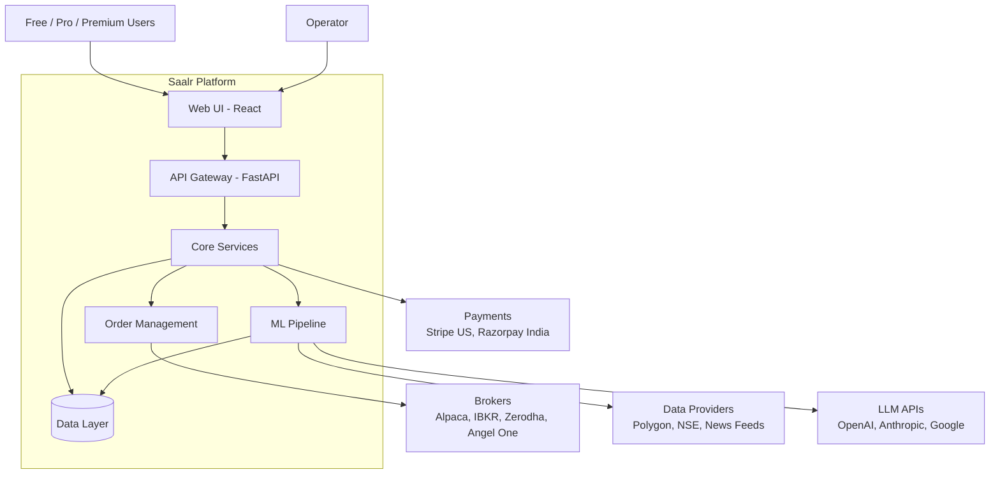
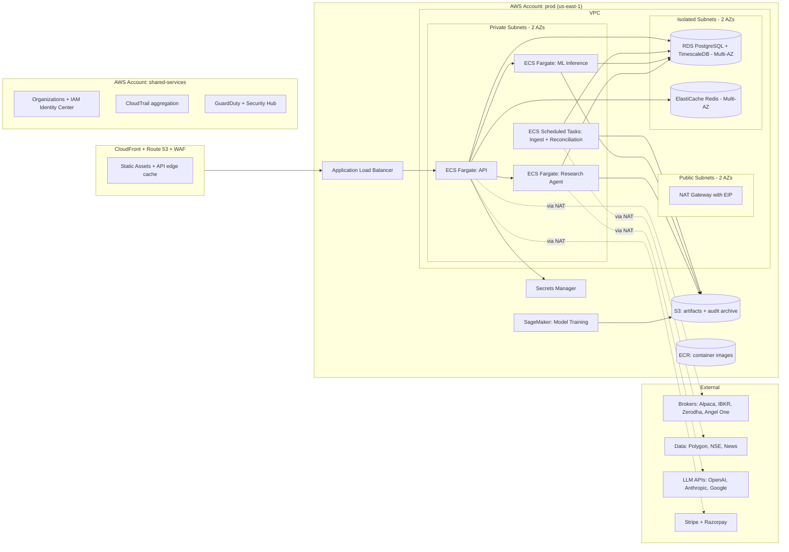

# Saalr — System Architecture

**Document version:** 2.1 (May 2026)
**Status:** Spec — seed-deck aligned (validation-first, pre-revenue)
**Supersedes:** v1.0 (personal-platform architecture, AWS-only)
**Companion documents:** HLD, LLD, Project Plan

---

## 1. Mission

Saalr is a research-grade options analytics platform for retail traders. It brings institutional tools — vol surface, Greeks, ML forecasting, sentiment-aware probability of profit — to traders who currently choose between toy products (Robinhood, Streak) and AI-hype scams. US-first, India-next.

The platform unifies three previously separate experiments — OptionsWorld (analytics), OptionsAcademy (education), researchbot (multi-agent research) — under one brand, one tenant model, one codebase.

Current operating reality: pre-revenue, solo-founder execution, three shipped codebases, and a validation-first go-to-market sequence before scale claims.

**Phase 1 scope lock (F&F):** build and launch for retail traders only. B2B, enterprise, and white-label motions are explicitly post-Phase 1.

### 1.1 Validation-first commitment (from Seed Deck v2)

- No claim of predictive edge before out-of-sample validation is published.
- If signal validation fails, models are retired publicly and positioning defaults to analytics + education.
- Paid growth targets are milestone-gated by measured cohort metrics (CAC, retention, ARPU), not assumed.

---

## 2. Actors

| Actor | Description | Access pattern |
|-------|-------------|----------------|
| **Free user** | Retail trader reading OptionsAcademy, exploring basic analytics | Web UI, anonymous → email auth |
| **Pro user** ($15/mo) | Paying retail trader using vol surface, Greeks, forecasting | Web UI + API key for personal automation |
| **Premium user** ($49/mo) | Serious retail trader using research agent, multi-broker execution, premium signals | Web UI + API + broker integrations |
| **Content author** | Creates OptionsAcademy modules, research notes | Admin UI |
| **Operator (founder)** | Monitors platform, manages incidents, deploys models | Admin UI + CLI + DB read access |
| **Broker APIs** | Alpaca, IBKR (US); Zerodha Kite, Angel One SmartAPI (India) | Per-broker protocols |
| **Data providers** | Polygon/Alpaca (US options), NSE Bhavcopy (India), news feeds | REST + WebSocket |
| **LLM APIs** | OpenAI, Anthropic, Google (for research agent) | REST |

---

## 3. System context

---

## 4. Architectural style

**Modular monolith for the core API. Independent ML workers. Multi-tenant from day one.**

### 4.1 Why modular monolith for the core API

- Solo founder, then small team. Microservices overhead is prohibitive at this scale.
- All core services share the same domain model (users, subscriptions, strategies, positions). Splitting them means distributed transactions; not worth it.
- Internal module boundaries are strict — modules call each other through explicit interfaces. This preserves the option to split later.

### 4.2 Why ML pipeline is separate

- ML workloads have different scaling, deployment, and observability needs.
- GARCH/LSTM/FinBERT inference is bursty; OMS is steady-state.
- Models are versioned and rolled out independently of the API.

### 4.3 Why multi-tenant from day one

- Every product surface (OptionsAcademy, OptionsWorld, Saalr) was built before unification with its own user model. Unifying these means a tenant-aware user model from the start.
- Retail-first still benefits from strict tenancy boundaries now; B2B and white-label remain post-Phase 1, but become easier later because tenancy is foundational.

---

## 5. Core capabilities

The platform delivers four capability families, mapped to subscription tiers:

| Capability | Free | Pro ($15) | Premium ($49) |
|-----------|------|-----------|---------------|
| **Education** | OptionsAcademy: 50+ modules, Greeks intuition, strategy mechanics | ✓ | ✓ |
| **Market data** | Delayed options chain, basic Greeks | Real-time chain, full Greeks, vol surface | + portfolio-level Greeks aggregation |
| **ML forecasting** | — | GARCH vol forecast, Monte Carlo POP | + sentiment-adjusted forecasts, regime detection |
| **Strategy builder** | View pre-built strategies | Multi-leg builder, payoff diagrams, backtest | + AI-assisted research agent |
| **Broker execution** | — | Paper trading via Alpaca/Zerodha | Live execution across all integrated brokers |
| **Research agent** | — | — | Multi-agent LLM research (fundamentals, sentiment, technical, risk) |
| **Portfolio reporting** | — | Daily P&L, Sharpe, drawdown | + news-exposure heatmap, attribution |

---

## 6. Tech stack

| Layer | Choice | Why |
|-------|--------|-----|
| **Frontend** | React 18 + TypeScript + Tailwind + Vite | Founder's stack. SSR not needed; product is auth-gated. |
| **API** | FastAPI (Python 3.12) | Shares language with ML pipeline. Async-native. OpenAPI auto-gen. |
| **ML pipeline** | Python — PyTorch (LSTM), arch (GARCH), Hugging Face (FinBERT), NumPy/Numba (Monte Carlo) | Open-source, battle-tested, no proprietary lock-in. |
| **Research agent** | LangGraph (forked TauricResearch/TradingAgents framework, adapted) as a separate internal ECS service | Isolates LLM cost/latency/failure modes from core API paths and enables independent scaling and budget controls. |
| **Primary DB** | RDS for PostgreSQL 16 + TimescaleDB extension (Multi-AZ) | Relational for users/subs/strategies; TimescaleDB (officially supported on RDS) for OHLCV, ticks, Greeks history. |
| **Cache + queue** | ElastiCache for Redis 7 (Multi-AZ) | Sessions, rate limiting, background job queue. |
| **Vector store** | pgvector (in the same RDS) | RAG over OptionsAcademy content for research agent. Avoids separate Pinecone/Weaviate. |
| **Object storage** | S3 (versioned, with Object Lock for audit archive) | Standard for AWS-native; cross-region replication for DR |
| **Compute** | ECS Fargate (long-running services) + ECS Scheduled Tasks (batch jobs) + SageMaker (ML training) | Pay-per-use; matches bursty ML workload; no servers to patch |
| **Container registry** | Amazon ECR | First-class with ECS; private by default |
| **CDN + edge** | CloudFront + Route 53 | AWS-native; AWS WAF integrates for L7 protection |
| **Observability** | CloudWatch (AWS metrics/logs) + OpenTelemetry → AWS Managed Prometheus + AWS Managed Grafana | Vendor-neutral instrumentation; AWS-native storage and dashboards |
| **Errors** | Sentry | Founder-friendly UX, free tier covers solo + seed-stage scale |
| **Auth** | Clerk (selected for Phase 1) | Fastest implementation path for B2C onboarding and session management. Keep an internal auth adapter to preserve migration optionality. |
| **Payments** | Stripe (US), Razorpay (India) | Standard for each geography. |
| **Secrets** | AWS Secrets Manager (with automatic rotation for DB credentials) | Native; KMS-backed; IAM-controlled access |
| **IaC** | Terraform | Multi-cloud capable (preserves optionality) but AWS provider is production-grade |
| **CI/CD** | GitHub Actions → ECR push → ECS service update | Founder-familiar; no separate CI/CD provider to manage |

---

## 7. Deployment topology

Single cloud (AWS), single region (us-east-1) for Year 1. Add ap-south-1 (Mumbai) post-seed when Indian user data residency under DPDP Act becomes a hard requirement.

**India data residency target (approved):** By Phase 4, India tenant PII and billing identity data are region-pinned to ap-south-1. Cross-region analytics uses pseudonymized IDs only; any exception requires legal approval.

**Account strategy (AWS Organizations):**
- **shared-services account:** IAM Identity Center (SSO), CloudTrail aggregation, GuardDuty, Security Hub, Route 53 hosted zones
- **prod account:** all production resources
- **staging account:** mirror of prod, scaled down (single-AZ, smaller instance classes)
- **dev account (optional):** for early experimentation; can be skipped initially

Three accounts cost nothing extra and protect against fat-finger production accidents. Cross-account access is via IAM Identity Center; no long-lived access keys for humans.

**VPC topology:**
- Three subnet tiers across 2 AZs: public (ALB, NAT), private (ECS), isolated (RDS, ElastiCache)
- Single NAT Gateway with a stable Elastic IP — this matters because Zerodha requires a registered static outbound IP for API access. ALL outbound traffic to brokers and data providers exits via this NAT.
- VPC endpoints (Gateway) for S3 and DynamoDB to keep that traffic off the NAT (cheaper, faster)
- VPC endpoints (Interface) for ECR, Secrets Manager, CloudWatch Logs (cost-saving at scale; defer until traffic justifies it)

**Why single region for Year 1:**
- Adding a second region triples operational complexity (data replication, DNS failover, cross-region IAM)
- Our SLO is 99.5% availability — achievable in single region with Multi-AZ
- DR is via cross-region RDS snapshot replication to us-west-2 (cold standby; manual restore in disaster)
- Multi-region active-active is a post-seed decision

**Why us-east-1:**
- Lowest latency to US broker APIs (Alpaca and IBKR are East Coast)
- Cheapest region for nearly all services
- Most service availability for new AWS releases
- Trade-off: higher latency for Indian users (~250ms vs ~50ms from ap-south-1). Acceptable until paying-user concentration justifies a second region.

**Cost estimate at seed scale (Month 18 traction):**
- ECS Fargate (4 services × 2 tasks × 0.5 vCPU/1GB): ~$80/mo
- RDS db.t4g.medium Multi-AZ + 100GB storage: ~$120/mo
- ElastiCache cache.t4g.small Multi-AZ: ~$45/mo
- ALB: ~$20/mo
- NAT Gateway (1) + data transfer: ~$50/mo
- S3 (100GB + traffic): ~$5/mo
- CloudFront (modest traffic): ~$15/mo
- ECR, Secrets Manager, CloudWatch, Route 53: ~$30/mo
- SageMaker training (on-demand, ~50 hrs/mo on cheap GPU): ~$50/mo
- **Core infra total: ~$415/mo at seed scale** (well under the 25% of MRR ceiling at $120K ARR)

---

## 8. Principles (non-negotiable)

These are commitments the architecture is designed to enforce:

1. **Multi-tenancy from day one.** Every table has a `tenant_id`. Every query filters on it. No exceptions.
2. **Honest model reporting.** Every ML model logs its baseline and its delta. If a model loses to its baseline on held-out data, the UI says so. No silent failures.
3. **Audit before action.** Every state-changing action writes to the audit log *before* the action commits. If audit infra is down, the action is rejected.
4. **No custody of user capital.** Saalr never holds, routes, or pools user money. Orders go from Saalr → user's broker via their authenticated API key.
5. **Glass-box ML.** Every model decision is explainable. No "AI says buy" buttons. Always show the inputs, the baseline, and why the model differed.
6. **Idempotent everything.** Every state-changing API accepts an idempotency key. Retries are safe.
7. **PII minimization.** Email, payment provider IDs, country. Nothing else. No SSNs, no PAN cards, no banking details — that all lives at the broker.
8. **Models versioned, retired, replaceable.** No model in production without a version number, a baseline, and a kill switch.
9. **India retail order-throttle compliance.** For India exchanges only, enforce SEBI's 10 orders/second cap per client per exchange before broker submission. US flows are not subject to this SEBI cap.
10. **No direct plugin SQL on production data.** External broker/LLM MCP plugins may only access portfolio analytics through Saalr-owned read-only functions/APIs with tenant scoping and audit logs.

---

## 9. What this architecture deliberately does NOT do

These are deferred decisions, listed explicitly so future-you doesn't quietly add them:

- **No HFT.** Sub-second execution is out of scope. Saalr is for retail position trading, swing trading, and longer-horizon strategies. Minute-bar granularity is the floor.
- **No order routing or custody.** Saalr is a software layer; brokers are the financial infrastructure. We never become an introducing broker.
- **No on-premise deployment.** Cloud-only. Enterprise/white-label customers who require on-prem are out of scope through Series A.
- **No mobile-native apps until Year 2.** Mobile-responsive web is sufficient. React Native or native iOS/Android is a post-seed decision.
- **No custom backtest engine in Phase 1.** We standardize on vectorbt and keep a thin internal engine adapter so replacement remains possible later.
- **No proprietary ML models.** All models are open-source (GARCH/arch, FinBERT/Hugging Face, LSTM/PyTorch). The moat is integration and reporting, not models.
- **No multi-region active-active.** Single region per cloud. DR via cross-region backups, not active failover. Premature for our scale.
- **No customer support chat ticketing UI.** Email + Discord + Intercom embed. No custom-built support tooling.

---

## 10. Roadmap phases

| Phase | Months | Goal | Architecture deliverable |
|-------|--------|------|--------------------------|
| **Phase 0: Signal validation** | Q3 2026 (8 weeks) | Earn the right to ML claims | OOS validation pack for GARCH/FinBERT on holdout; publish pass/fail; retire underperforming models if needed |
| **Phase 1: First paid US cohort (Retail-only)** | Q4 2026 (12 weeks) | Convert first paying users with measured economics | Unified AWS stack live; shared auth/billing; first 50 paying US users; real CAC/retention instrumentation |
| **Phase 2: India launch** | Q1–Q2 2027 | Launch second geography under compliance constraints | India entity + RA progress, Zerodha-first execution, INR billing path, residency controls in-flight |
| **Phase 3: Seed execution milestones** | Q3–Q4 2027 | Reach seed-plan operating targets | Target M18: 5K free / 200 paid / ~$80K ARR; target M24: ~$1M ARR run-rate with retention-backed cohorts |

### 10.1 Planning targets (from Seed Deck v2)

- Current state: pre-revenue; paying users = 0; validation in progress.
- Month 18 target: 5,000 free users, 200 paying users, ~$80K ARR.
- Month 24 target: ~$1M ARR run-rate, ~30K free users, ~2,500 paying users.
- Seed ask context: $2M raise to fund validation, hiring, growth, and infra over the execution window.

---

## 11. Open architectural questions

These are unresolved and need answers before Phase 1 begins:

- **Resolved:** Auth provider = **Clerk** for Phase 1. Re-evaluate at 5K MAU or first enterprise SSO requirement.
- **Resolved:** Use a **single TimescaleDB instance through Year 1** (plus read replicas and tuning) and only evaluate sharding when at least 2 of the following hold for 4 consecutive weeks:
    - p95 peak CPU > 70%
    - projected storage exhaustion < 90 days
    - p99 market-query latency > 800ms
    - ingestion lag during market hours > 30s
- **Resolved:** Research agent runs as a **separate internal ECS service** from Phase 1, with independent scaling, timeout ceilings, and per-tenant budget guardrails.
- **Resolved:** Mobile stays responsive-web-first until escalation triggers are met (see §11.4).
- **Resolved:** India data residency target is committed for Phase 4: India tenant PII + billing identity fields stay in ap-south-1; cross-region analytics is pseudonymized.
- **Resolved:** Backtest engine = **vectorbt for Phase 1**. Re-evaluate only after strategy schema and metrics stabilize under real usage.

### 11.1 Time-series scaling policy (resolved)

For Year 1, default to vertical scaling + query tuning + read replicas before considering shard complexity. Sharding discussion starts only when at least 2 trigger conditions above are sustained for 4 consecutive weeks.

### 11.2 Backtest engine policy (resolved)

Phase 1 uses vectorbt behind a thin internal engine interface. Every backtest run must support deterministic replay (seed + version pinning) and configurable realism knobs (slippage, commissions, liquidity assumptions).

### 11.3 India data residency policy (resolved)

From Phase 4 onward:
- India-tenant PII and billing identity data are stored and processed in ap-south-1.
- Cross-region analytics and model training datasets must use pseudonymized tenant/user identifiers.
- Cross-border replication of India-tenant PII is disallowed by default and requires explicit legal sign-off.

### 11.4 Mobile escalation policy (resolved)

Stay responsive-web-only until at least one product trigger and one business trigger are sustained for 8 consecutive weeks:
- Product trigger options:
    - Mobile push-style alert latency requirement is < 60s for a core paid workflow.
    - Mobile-web UX blocks a critical workflow (order placement/status, alerts, watchlists) at unacceptable drop-off.
- Business trigger options:
    - Mobile-first WAU share >= 40%.
    - Mobile conversion or retention underperforms desktop by >= 20% despite responsive optimization.
    - Mobile-related support tickets exceed 15% of total support volume.

When triggered, start with a React Native shell for alerts, watchlists, and order status/placement; keep advanced strategy building web-first.

---

## 12. Implementation order

Build foundational pieces first, hot-path pieces last. This minimizes the time before end-to-end smoke tests pass and maximizes the time foundational pieces have to mature:

1. **Signal-validation harness + public reporting workflow** (OOS holdout evaluation, baseline deltas, publishable validation report format).
2. **Audit log + observability foundation** (Sentry, OpenTelemetry → Grafana). Build before any application code.
3. **Multi-tenant data layer** (Postgres + TimescaleDB schemas, with `tenant_id` everywhere).
4. **Auth & subscription billing** (Clerk + Stripe + Razorpay).
5. **Market data ingestion + Greeks calculator** (deterministic, no ML — get the foundation right).
6. **Vol surface + strategy builder** (UI-heavy, ML-light — establishes product feel).
7. **ML pipeline: GARCH first, then Monte Carlo, then FinBERT.** Each with baseline + honest reporting from day one.
8. **OMS + broker adapter pattern** (Alpaca first — easiest API, US market).
9. **Research agent productionization** (forked TradingAgent framework adapted to Saalr's tenancy model).
10. **Second broker per geography** (Zerodha second — proves the adapter pattern).

See HLD §4 for service decomposition and LLD §13 for module-level implementation order.

---

**Companion documents to read next:**
- `Saalr-HLD.md` — service decomposition, contracts, NFRs
- `Saalr-LLD.md` — database DDL, API schemas, algorithm specs
