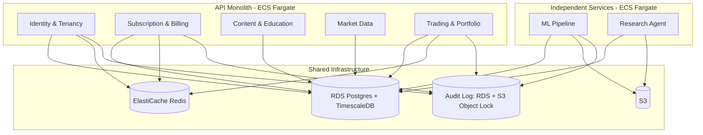
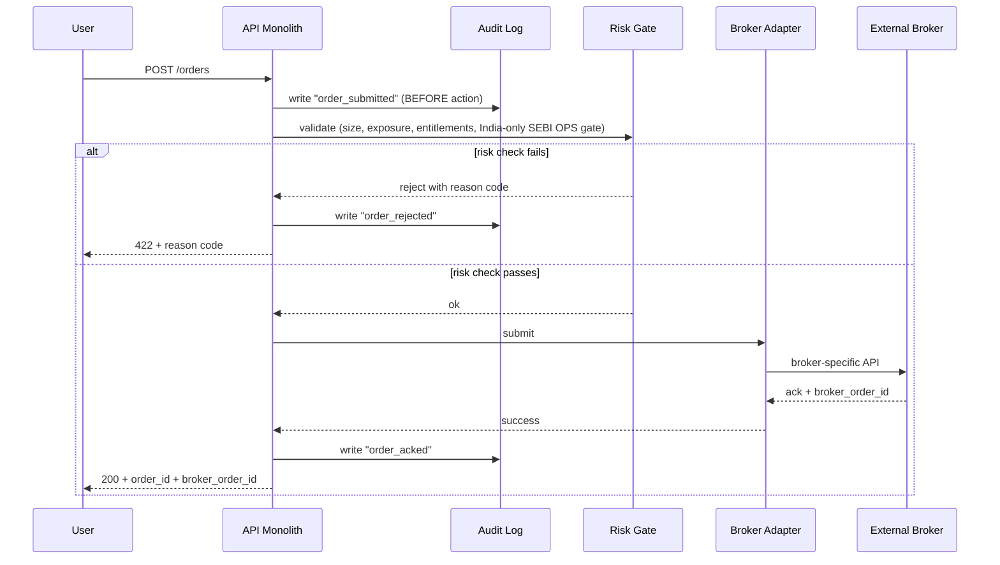
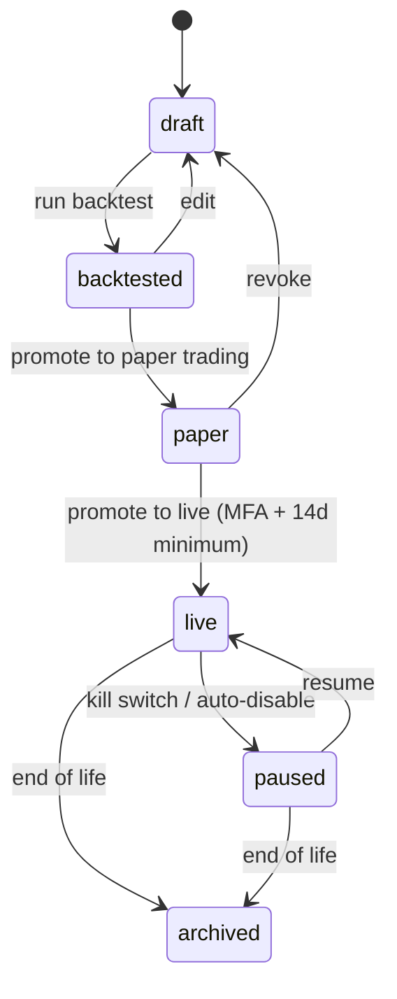

# Saalr — High-Level Design (HLD)

**Document version:** 2.1 (May 2026)
**Status:** Spec — seed-deck aligned (validation-first)
**Supersedes:** v1.0 (personal-platform HLD)
**Companion documents:** Architecture, LLD

---

## 1. Document purpose

Architecture defines **what** the system is and the principles it embodies. This HLD defines **how** it's decomposed into services, how those services interact, and what each service's contract with the rest of the system looks like. The LLD then defines exactly how each service implements its contract.

Read this if you want to:
- Understand the service boundaries before writing code
- Add a new component that fits into the existing system
- Trace a request from a user action through the system
- Know what SLOs and NFRs each component must meet

**Phase 1 scope lock:** this HLD is optimized for retail-trader workflows only. Enterprise/B2B/white-label requirements are intentionally deferred.

Validation-first operating mode: model and growth claims are gated by measured results, not implementation completion.

---

## 2. Service decomposition

The platform is decomposed into seven service families. The first five run inside the API monolith (sharing process, deployment, and database). The last two are independently deployable.



---

## 3. Identity & Tenancy

### 3.1 Responsibility
Authentication, session management, tenant resolution, role-based access. The gate that decides who you are and what you can see.

### 3.2 Tech
- **Provider:** Clerk (selected for Phase 1; re-evaluate at 5K MAU or first enterprise SSO requirement)
- **Storage:** Postgres `tenants`, `users`, `memberships`, `api_keys` tables
- **Sessions:** Provider-managed JWT, Redis for revocation lists
- **Boundary:** Internal auth adapter interface to preserve migration optionality

### 3.3 Public API surface (representative)
```
POST   /auth/signup
POST   /auth/login
POST   /auth/logout
GET    /me                         → current user + tenant + tier
POST   /api-keys                   → create personal API key
GET    /api-keys                   → list keys
DELETE /api-keys/{key_id}          → revoke key
```

### 3.4 Tenancy model
- One **tenant** = one user account = one billing relationship.
- B2B / family-shared accounts are future; Phase 1 UX remains strict 1:1 retail. `memberships` exists for forward-compatibility but is not exposed as a multi-user tenant feature in Phase 1.
- Every row in every table carries `tenant_id`. Every query filters on it. Row-Level Security in Postgres enforces this even if application logic forgets.

### 3.5 Dependencies
- Stripe / Razorpay customer IDs created on signup (lazy: created on first paid action)
- Clerk webhooks → Identity service to keep local state in sync

### 3.6 NFRs
- **Latency:** Login p95 < 300ms (Clerk-bounded)
- **Availability:** 99.9% (degraded mode: if Clerk is down, allow cached sessions to keep working for up to 1 hour)
- **Security:** MFA available; required for users with API keys

---

## 4. Subscription & Billing

### 4.1 Responsibility
Plan management, entitlements (what each tier unlocks), payment processing, dunning, geo-aware payment routing.

### 4.2 Tech
- **US payments:** Stripe (cards + ACH)
- **India payments:** Razorpay (cards + UPI + netbanking)
- **State of record:** Postgres `subscriptions`, `entitlements` (mirror of provider state + idempotent webhooks)

### 4.3 Public API surface
```
GET    /subscription              → current plan + entitlements
POST   /subscription/upgrade      → start upgrade flow (returns checkout URL)
POST   /subscription/cancel       → cancel at period end
POST   /webhooks/stripe           → Stripe events
POST   /webhooks/razorpay         → Razorpay events
```

### 4.4 Entitlement model
Entitlements are computed from the plan, not stored per-user. The plan-to-entitlement mapping lives in code, version-controlled:

```python
# Pseudocode — see LLD §5 for actual schema
TIERS = {
  "free":    Entitlements(live_chains=False, vol_surface=False, ml_forecast=False, research_agent=False, brokers=0),
  "pro":     Entitlements(live_chains=True,  vol_surface=True,  ml_forecast=True,  research_agent=False, brokers=2),
  "premium": Entitlements(live_chains=True,  vol_surface=True,  ml_forecast=True,  research_agent=True,  brokers=4),
}
```

This avoids the "entitlements drift from plan" bug class entirely.

### 4.5 Dependencies
- Identity service (for tenant resolution)
- Stripe, Razorpay (external)

### 4.6 NFRs
- **Webhook handling:** must be idempotent; same Stripe event must produce identical state
- **Latency:** entitlement check < 5ms p99 (cached in Redis with 60s TTL)
- **Reliability:** dunning automation kicks in after 3 failed charges (Stripe) or 2 (Razorpay)

---

## 5. Content & Education

### 5.1 Responsibility
OptionsAcademy course delivery, progress tracking, RAG-indexed content corpus, free-tier funnel mechanics.

### 5.2 Tech
- **Content storage:** Markdown files in Git → built to JSON at CI time → served from CDN
- **Progress tracking:** Postgres `user_progress`
- **RAG index:** pgvector with OpenAI embeddings (cached)

### 5.3 Public API surface
```
GET    /content/modules                       → list modules (free)
GET    /content/modules/{slug}                → module body + metadata
POST   /content/modules/{slug}/complete       → mark complete
GET    /content/search?q=...                  → text + semantic search
```

### 5.4 Why content is in Git, not the DB
- Content is curated, slow-changing, and high-trust. Author workflow is "PR + review + merge" not "click in CMS."
- Markdown in Git versions cleanly, diffs cleanly, code-reviews cleanly.
- The DB stores only progress/analytics, not content body. Content body is immutable per version; if you change a module, that's a new version.

### 5.5 Dependencies
- Identity service (for progress tracking)
- LLM API (for embedding generation at content build time)

### 5.6 NFRs
- **Latency:** module fetch < 100ms p95 (served from CDN edge)
- **Search latency:** < 500ms p95 (pgvector kNN + Postgres FTS hybrid)

---

## 6. Market Data

### 6.1 Responsibility
Ingest options chains, ticks, fundamentals, news from providers. Persist to TimescaleDB. Serve to other services with caching.

### 6.2 Tech
- **US data:** Polygon (options chains + Greeks), Alpaca (real-time bars), NewsAPI/EODHD (news)
- **India data:** NSE Bhavcopy (end-of-day, free), Upstox feed (real-time, paid)
- **Ingestion:** ECS Scheduled Tasks (EventBridge cron) + WebSocket consumers on ECS Fargate for real-time
- **Storage:** TimescaleDB hypertables partitioned by `(tenant_view, ticker, timestamp)` — note: tenant_view is for licensing tracking; data is shared across tenants
- **Cache:** Redis for hot tickers (last 24h ticks in memory)

### 6.3 Public API surface
```
GET /market/chain?ticker=AAPL&expiry=2026-06-21    → options chain snapshot
GET /market/iv-surface?ticker=AAPL                 → vol surface JSON
GET /market/quote?ticker=AAPL                      → spot, bid/ask, change
GET /market/news?ticker=AAPL&since=...             → news + FinBERT scores
```

### 6.4 Licensing & cost control
- Polygon, Upstox are paid per-symbol-per-month. Cost is a real constraint.
- Free tier sees delayed (15-min lagged) data; Pro+ sees real-time.
- Symbol universe expands with subscriber count, not all tickers from day one.
- Every market data API call increments a `data_usage` counter for cost attribution.

### 6.5 Dependencies
- External: Polygon, Alpaca, NSE, Upstox, NewsAPI, EODHD
- Internal: ML pipeline (consumes); Trading service (consumes)

### 6.6 NFRs
- **Freshness:** real-time data < 1s end-to-end (provider → Saalr API)
- **Availability:** 99.5% — degrades to delayed/cached when provider fails
- **Cost ceiling:** market data spend ≤ 15% of MRR

### 6.7 Time-series scaling policy
- Year 1 default: single TimescaleDB instance with vertical scaling, query/index tuning, and read replicas before sharding.
- Sharding evaluation starts only when at least 2 of these hold for 4 consecutive weeks:
    - p95 peak CPU > 70%
    - projected storage exhaustion < 90 days
    - p99 market-query latency > 800ms
    - ingestion lag during market hours > 30s

---

## 7. Trading & Portfolio

### 7.1 Responsibility
Strategy storage, backtest orchestration, order management (OMS), broker adapters, position tracking, portfolio reporting.

### 7.2 Tech
- **Backtest engine:** vectorbt (Python) — see ADR-002
- **OMS state:** Postgres `orders`, `positions`, `executions`
- **Broker adapters:** one per broker, common interface (see LLD §6)
- **Reconciliation:** ECS Scheduled Task (EventBridge) every 5 min syncs broker state to local

### 7.3 Public API surface
```
POST   /strategies                          → create strategy
GET    /strategies                          → list user's strategies
GET    /strategies/{id}                     → strategy detail
POST   /strategies/{id}/backtest            → kick off backtest job
GET    /backtests/{id}                      → backtest result (poll)

POST   /orders                              → submit order (paper or live)
GET    /orders                              → list orders
DELETE /orders/{id}                         → cancel pending order

GET    /portfolio                           → current positions + P&L
GET    /portfolio/greeks                    → aggregated portfolio Greeks
GET    /portfolio/history?period=30d        → P&L time series
GET    /portfolio/performance?period=30d&strategy_id=...   → Sharpe/Sortino/drawdown from executed transaction history
```

### 7.4 Order flow



The critical commitment: **audit writes happen BEFORE the broker call.** If audit infra is down, we don't trade. This is the single most important architectural rule.

### 7.5 Strategy lifecycle



The `paper → live` transition requires MFA re-auth and a minimum 14-day paper trading period. Strategy must show backtest Sharpe ≥ 1.0 with realistic costs to be promoted. These gates are *conservative on purpose*.

### 7.6 Dependencies
- Identity (tenant scoping)
- Subscription (entitlement check: tier allows live trading? how many brokers?)
- Market Data (for backtest historical data)
- ML Pipeline (for sentiment-adjusted signals if strategy uses them)
- Audit Log (every action)
- External: brokers

### 7.7 NFRs
- **Order submission latency:** p95 < 500ms (Saalr-side; broker latency excluded)
- **India retail order throttle:** hard cap 10 orders/sec per client per exchange (SEBI); enforced only for India exchanges
- **Reconciliation freshness:** position state matches broker within 10 min
- **Backtest throughput:** 1000 strategy-bars/sec per worker

### 7.8 External plugin analytics access policy
- Broker or LLM MCP plugins must not query production Postgres directly.
- Plugins access transaction-history analytics only through Saalr-controlled read-only APIs/functions.
- Every plugin request is tenant-scoped, rate-limited, and audit-logged.
- Metrics output must include assumptions used for Sharpe-family computations (risk-free rate and sampling frequency).

---

## 8. ML Pipeline

### 8.1 Responsibility
Vol forecasting (GARCH), price forecasting (LSTM + ARIMA baseline), sentiment scoring (FinBERT), probability-of-profit (Monte Carlo). Honest reporting of each model's performance vs baseline.

### 8.2 Tech
- **Inference service:** ECS Fargate behind internal ALB, FastAPI, target-tracking autoscaling on CPU
- **Batch jobs:** ECS Scheduled Tasks (daily retrain, nightly forecasts)
- **Model storage:** S3 bucket with versioning enabled, immutable per-version objects
- **Training:** SageMaker Training Jobs (on-demand GPU instances; pay per training-hour)

### 8.3 Internal API surface
ML is internal-facing; consumed by Trading & Market Data services. Not directly exposed to users.

```
POST /ml/garch/forecast        body: {ticker, horizon_days}
POST /ml/lstm/forecast         body: {ticker, horizon_days}
POST /ml/sentiment/score       body: {headlines: [...]}
POST /ml/monte-carlo/pop       body: {legs: [...], spot, days_to_expiry}
GET  /ml/models/{name}/stats   → live performance: baseline vs model, OOS Sharpe equivalent
```

### 8.4 Honest reporting commitment
Every ML model has:
1. A defined **baseline** (naive forecast or ARIMA, see LLD §4)
2. A **held-out test set** the model never sees during training
3. A **live performance metric** computed daily on yesterday's predictions
4. A **degradation alert** when live performance drops below a threshold
5. A **retirement protocol** when the model loses to its baseline on a 30-day rolling window

The user-facing UI surfaces all of this. When a model is underperforming, the product *says so* — it doesn't hide.

Before any paid signal claim is made externally, a publishable validation report must exist for the relevant model cohort/time window.

### 8.5 Dependencies
- Market Data (training + inference inputs)
- LLM APIs (FinBERT runs locally; LLM calls only via Research Agent service)
- Audit (model version, training timestamp, performance metric per run)

### 8.6 NFRs
- **Inference latency:** GARCH < 100ms, Monte Carlo (10K paths) < 500ms, FinBERT batch (100 headlines) < 2s
- **Training cadence:** GARCH and LSTM retrained nightly; FinBERT retrained quarterly
- **Cost ceiling:** ML compute ≤ 20% of MRR

---

## 9. Research Agent (Premium only)

### 9.1 Responsibility
Multi-agent LLM-orchestrated research. Adapted from forked TauricResearch/TradingAgents framework. Produces structured research notes per ticker.

### 9.2 Tech
- **Framework:** LangGraph (Python)
- **Agents:** Fundamentals, Sentiment, Technical, Risk, Trader, Portfolio Manager
- **LLM providers:** OpenAI (primary), Anthropic (fallback), Google (overflow)
- **Output storage:** Postgres `research_notes` + S3 for full agent transcripts

### 9.3 Public API surface
```
POST /research/run        body: {ticker, depth: "shallow"|"deep"}    → kicks off async run
GET  /research/runs/{id}                                              → status + result when ready
GET  /research/notes                                                  → list completed notes
```

### 9.4 LLM cost control
- Per-tenant rate limit: 10 deep runs / day on Premium tier
- Per-ticker cache: same ticker re-run within 6h returns cached result + delta highlights
- Budget alert: per-tenant LLM spend > $X/month → notify operator
- Cost-of-decision: every research note has total LLM cost stamped on it

### 9.5 Why it's a separate service
- LLM workloads have different scaling (long-running, bursty)
- Different failure modes (LLM rate limits, model deprecation)
- Different cost characteristics (per-token billing, not per-request)
- Separation makes it easy to disable Research Agent during cost spikes without affecting the rest of the platform

### 9.6 Dependencies
- Market Data (inputs to agents)
- Content (RAG over OptionsAcademy for context)
- ML Pipeline (sentiment scores feed into Sentiment agent)
- Audit (every LLM call logged with cost)

### 9.7 NFRs
- **Shallow run latency:** < 30s p95
- **Deep run latency:** < 5 min p95
- **Availability:** 99% (degrades to "research unavailable" rather than blocking other features)

---

## 10. Cross-cutting concerns

### 10.1 Multi-tenancy enforcement

Every table has `tenant_id NOT NULL`. Postgres Row-Level Security policies enforce isolation:

```sql
-- representative; see LLD §3.7
CREATE POLICY tenant_isolation ON strategies
  USING (tenant_id = current_setting('app.current_tenant')::uuid);
```

API middleware sets `app.current_tenant` from the JWT before every request. If middleware is bypassed (e.g., bug), RLS still blocks cross-tenant reads. Defense in depth.

### 10.2 Audit log

Append-only. Every state-changing action writes one row. Schema (see LLD §3.5):
```
audit_id, tenant_id, user_id, action, target_type, target_id,
before_state_json, after_state_json, request_id, timestamp, ip
```
Stored in Postgres (hot) and replicated to S3 with Object Lock in Compliance mode (immutable). Hot rows are queryable; the S3 archive is the compliance artifact.

### 10.3 Observability

Three signals:
- **Traces:** OpenTelemetry SDK in FastAPI + ML workers. Every request has a `trace_id` propagated through DB calls and external API calls. Grafana Tempo for storage.
- **Metrics:** Prometheus-format counters/gauges/histograms. Grafana Cloud Metrics for storage.
- **Logs:** Structured JSON. Loki for storage. Every log has `trace_id`, `tenant_id`, `request_id`.

Default dashboards: API latency, ML inference latency, broker order success rate, LLM cost per tenant, audit log freshness.

### 10.4 Rate limiting

Token bucket per `tenant_id` per endpoint group. Limits scale with tier. Enforced in API middleware via Redis. Returns 429 with `Retry-After` header.

For India retail trading endpoints (`market=IN`), an additional compliance limiter is mandatory: max 10 orders/sec per client per exchange (SEBI). This limiter does not apply to US exchanges.

### 10.5 Idempotency

Every POST and PATCH accepts an optional `Idempotency-Key` header. Cached for 24h in Redis with full response. Same key + different body → 409 Conflict. Critical for order submission and webhook processing.

### 10.6 Configuration

Three sources:
- **Build-time:** Tier definitions, feature flags (default on/off), broker adapter registry — Python constants
- **Runtime:** Per-tenant overrides, kill switches, A/B test allocations — Postgres `config` table, hot-reloaded
- **Secrets:** API keys, DB credentials, per-user broker credentials — AWS Secrets Manager, accessed by ECS task role at runtime via IAM. Automatic rotation enabled for RDS credentials.

Never put secrets in env vars committed to source. Never put per-tenant overrides in build-time config.

### 10.7 Claims governance (deck-aligned)

- Capability statuses are tracked as `built`, `code_complete`, or `validated`.
- External claims (deck, website, paid pages) may use `validated` only when OOS validation results are published.
- If a model fails holdout/baseline checks, status is downgraded and UI/marketing copy must reflect the downgrade.

---

## 11. Non-functional requirements summary

| Concern | Target |
|---------|--------|
| **API p95 latency** | < 500ms (cold path); < 100ms (cached path) |
| **API availability** | 99.5% (Year 1); 99.9% (post-seed) |
| **Order submission success** | > 99.5% (Saalr-side; broker errors excluded) |
| **Time to first interactive page load** | < 2s on 3G |
| **Data freshness (real-time)** | < 1s lag from provider |
| **Backtest job completion** | < 5 min for 1-year daily-bar strategy |
| **Audit log lag** | < 30s from action to log persistence |
| **MTTR (P1 incident)** | < 1 hour during business hours |
| **Cost ceiling** | Total infra ≤ 25% of MRR by Month 18 |
| **Claim integrity** | 0 externally published "validated" claims without a linked OOS report |

---

## 12. Architecture Decision Records

Key decisions, with reasoning. Each ADR is reversible but expensive to reverse — so they're documented.

### ADR-001: Use third-party auth (Clerk/Auth0) instead of self-hosted
**Status:** Accepted
**Decision:** Use Clerk for Phase 1 via an internal auth adapter boundary; re-evaluate only at 5K MAU or first enterprise SSO requirement.
**Why:** Auth is a solved problem; self-hosting costs more in security risk than provider fees. Clerk maximizes implementation speed at current stage while the adapter preserves migration flexibility.
**Reversible?** Yes, with a few weeks of migration work. JWT format is portable.

### ADR-002: Use vectorbt for backtesting, not custom engine
**Status:** Accepted
**Decision:** Wrap vectorbt with our own strategy API. Don't build a backtest engine from scratch.
**Why:** Backtest engines are commodity. vectorbt is fast (numpy-vectorized), accurate (handles costs, slippage), and actively maintained. Founder-time saved is more valuable than engine ownership.
**Reversible?** Yes, but only by reimplementing — which we won't.

### ADR-003: Modular monolith for core API, separate services for ML and Research Agent
**Status:** Accepted
**Decision:** Identity, Subscription, Content, Market Data, Trading run in one process. ML Pipeline and Research Agent are separate.
**Why:** Core API services share the domain model; splitting them means distributed transactions. ML and Research have different scaling/cost/failure profiles, so separation is real.
**Reversible?** Splitting more services later is easy if module boundaries stay clean. Merging back is hard.

### ADR-004: pgvector for embeddings, not separate vector DB
**Status:** Accepted
**Decision:** Use Postgres + pgvector for RAG embeddings. No Pinecone, Weaviate, or Qdrant.
**Why:** One DB to operate, back up, scale. Embeddings volume is small (OptionsAcademy is ~50 modules + user-generated research notes; well under 1M vectors). pgvector + HNSW index is fast enough at this scale.
**Reversible?** Yes. Vectors are portable. Switch when scale demands.

### ADR-005: Dual cloud (GCP + Azure), not single
**Status:** Superseded by ADR-008 (May 2026)
**Original decision:** GCP primary; Azure for ML training only.
**Why superseded:** Operational overhead of dual cloud (two IAM models, two billing dashboards, two networking surfaces, cross-cloud sync) exceeded the savings from preserving existing OptionsWorld/Azure setup. With OptionsWorld + OptionsAcademy still pre-traction, the migration cost is low and amortizes over the entire Phase 1+ build. Single-cloud also dramatically simplifies the SRE story at seed-stage hiring.
**Reversible?** Reversed.

### ADR-006: No custody of user capital
**Status:** Accepted (immutable)
**Decision:** Saalr never holds, routes, or pools user money. Period.
**Why:** Custody triggers a different regulatory regime (broker-dealer in US, broker license in India). Out of scope for foreseeable future.
**Reversible?** Only with significant regulatory work. Default answer: no.

### ADR-007: Honest model reporting as product surface
**Status:** Accepted (immutable)
**Decision:** Every ML model exposes its baseline performance, its delta, and its kill switch to the user UI.
**Why:** It's the brand. Reversing means becoming another AI-hype product, which destroys positioning.
**Reversible?** No. This is a brand commitment, not a tech decision.

### ADR-008: AWS as single-cloud provider
**Status:** Accepted (May 2026; supersedes ADR-005)
**Decision:** Run all production infrastructure on AWS. Migrate OptionsWorld and OptionsAcademy from Azure+GCP during Phase 1. Single region us-east-1 for Year 1. From Phase 4 onward, India-tenant PII and billing identity data are region-pinned to ap-south-1.
**Why:**
- One IAM, billing, networking, and SRE surface — meaningful at solo-founder and small-team scale
- AWS service depth covers every Saalr need with first-class managed offerings (RDS supports TimescaleDB, SageMaker for ML training, Secrets Manager with rotation, IAM Identity Center for human access)
- Founder-team familiarity dominates: hiring CTO/senior engineers post-seed is easier with AWS than dual-cloud
- Cost at seed scale (~$415/mo core infra) is below the 25%-of-MRR ceiling and predictable
- Static outbound IP via NAT Gateway EIP solves Zerodha's "registered IP" requirement cleanly
**Risks accepted:**
- Vendor lock-in to AWS — mitigated by IaC (Terraform) being multi-cloud capable and keeping application code provider-agnostic where possible
- Single-cloud failure exposure — mitigated by Multi-AZ within region and cross-region RDS snapshot replication for DR
**Reversible?** Yes, but expensive (weeks of migration work). No plans to reverse.

---

## 13. Open questions

To be resolved before each marked phase begins:

| Question | Phase | Default if not resolved |
|----------|-------|------------------------|
| **Q1:** Real-time data provider for India | Phase 4 | Upstox feed (cheapest with good docs) |
| **Q2:** Research Agent: open-source LLMs for cost optimization | Phase 5 | Stay on OpenAI/Anthropic until LLM cost > 30% of MRR |
| **Q3:** Reconciliation as separate service | Post-seed | Stays in monolith until OMS latency requires split |

### 13.1 Resolved policies now treated as constraints
- **Auth provider:** Clerk for Phase 1, with adapter boundary.
- **Research isolation:** Research Agent remains a separate internal service.
- **Backtesting:** vectorbt in Phase 1 behind a thin internal engine interface; deterministic replay and realism knobs are mandatory.
- **India residency target:** by Phase 4, India-tenant PII and billing identity remain in ap-south-1; cross-region analytics uses pseudonymized identifiers.
- **Mobile escalation:** stay responsive-web-first until one product trigger and one business trigger persist for 8 consecutive weeks.
- **Phase 1 market scope:** retail users only; no enterprise/B2B/white-label feature commitments in this phase.

---

## 14. What this HLD does not cover

- **Exact database schema and DDL** — see LLD §3
- **API request/response schemas in detail** — see LLD §4
- **Algorithm specifications** (GARCH parameters, FinBERT scoring, Monte Carlo) — see LLD §5
- **Error code catalog** — see LLD §10
- **Module-internal class structures** — see LLD §6
- **Deployment procedures, runbooks** — separate Operations Runbook
- **Strategy authoring guide** — separate Strategy Development Guide

---

**Read next:**
- `Saalr-LLD.md` — implementation-grade specs you'll code against
- Architecture document for the conceptual frame this HLD inherits from
